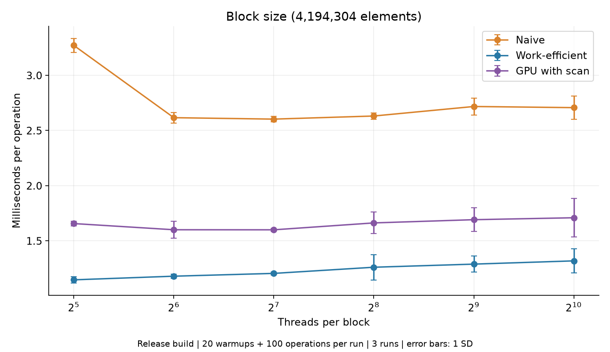
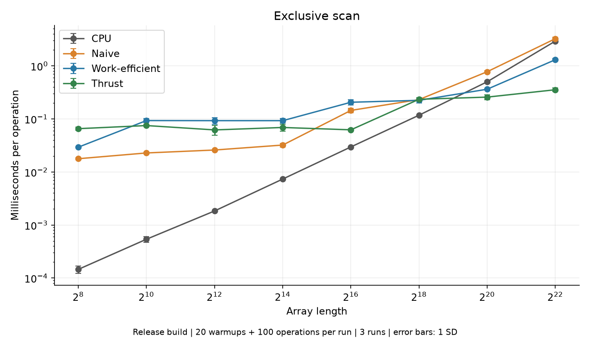
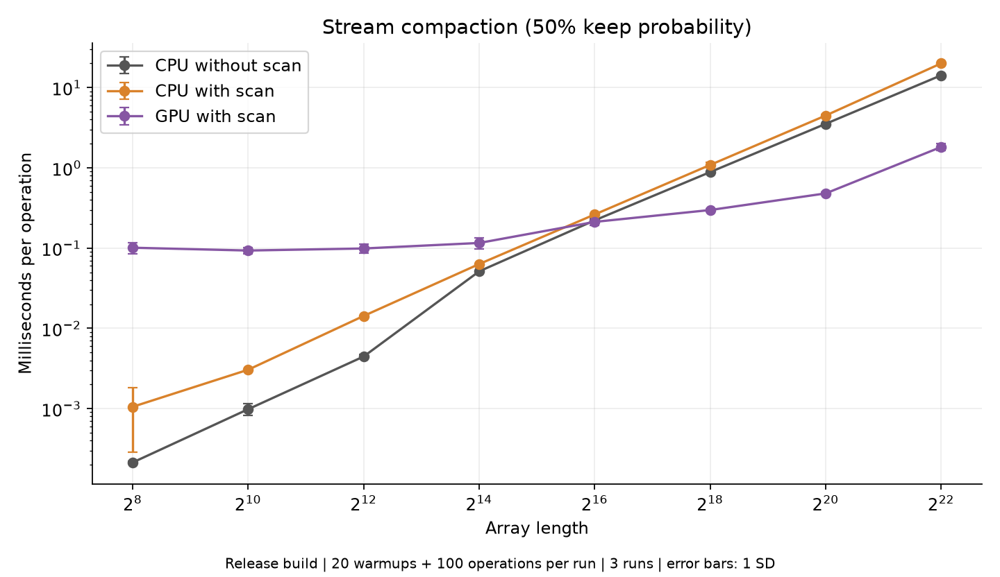
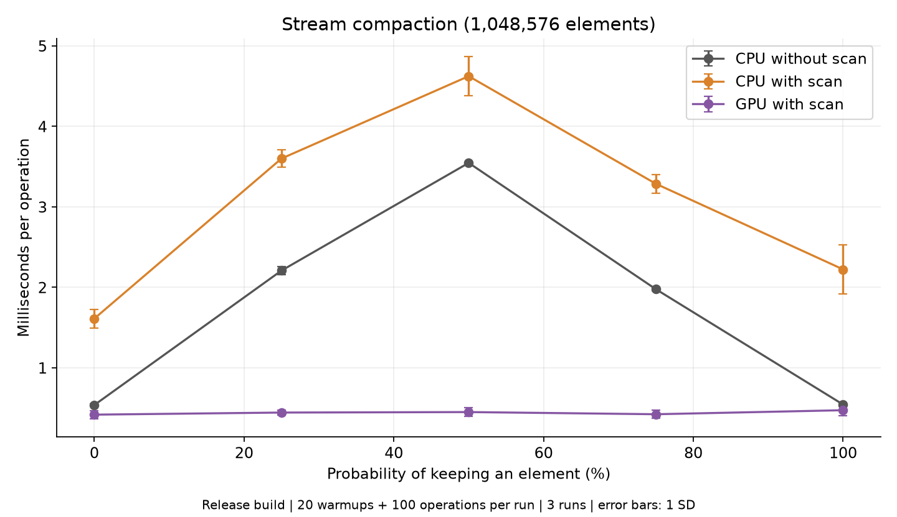
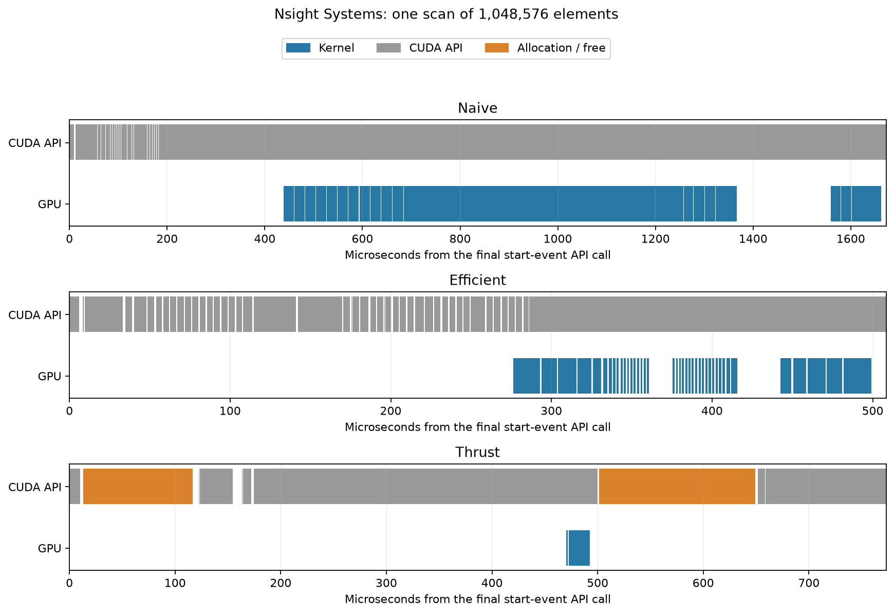
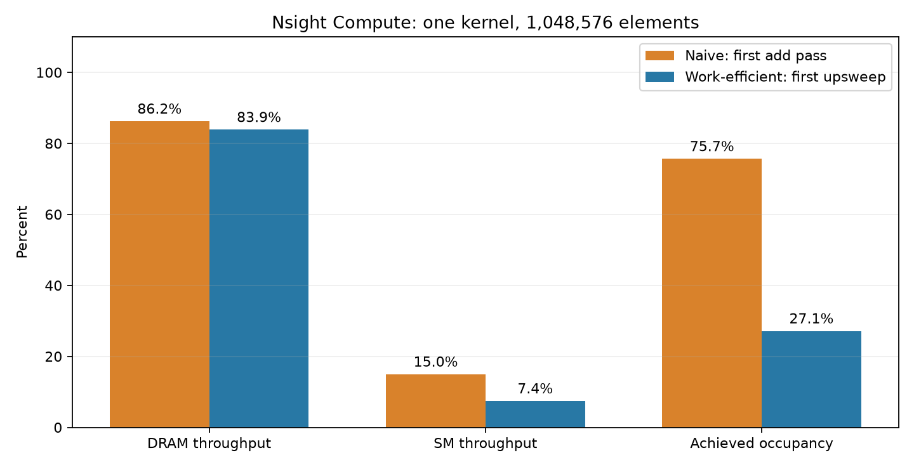

CUDA Stream Compaction
======================

**University of Pennsylvania, CIS 5650: GPU Programming and Architecture, Project 2**

* Zachary Kelly
* Tested on: Windows 11 Pro, AMD Ryzen 7 3700X, NVIDIA GeForce RTX 3070 8 GB
* CUDA 13.3, NVIDIA driver 616.56, Release build

## Implementations

This project removes zeros from an array without changing the order of the remaining
values. I implemented four exclusive scans and three versions of stream compaction:

* **CPU scan:** A running sum in a simple loop.
* **Naive GPU scan:** Shift the input right and put zero at the start. Each pass adds
  the value one, two, four, and then more positions back. Two arrays alternate between
  reading and writing so threads do not overwrite values that other threads still need.
* **Work-efficient GPU scan:** Add pairs going up a tree, set the root to zero, and
  pass prefixes back down. I pad the input with zeros to the next power of two.
* **Thrust scan:** A call to `thrust::exclusive_scan` on device vectors.
* **CPU compaction without scan:** Copy each nonzero value to the next free output slot.
* **CPU compaction with scan:** Make keep flags, scan them, and scatter the kept values.
* **GPU compaction:** Use the same three steps with the work-efficient scan on the GPU.

The exclusive scan example on lecture slides 18-20 helped check which side of each
value the sum belongs on. For `[3, 1, 7, 0, 4, 1, 6, 3]`, the output is
`[0, 3, 4, 11, 11, 15, 16, 22]`. The first output is always zero.

Recitation slides 6-7 show the upsweep and downsweep separately. I kept them as separate
kernels so each step is easy to follow. Each thread handles one pair, and each level
gets its own kernel launch. These launches keep one level from reading an unfinished
result from the previous level.

For compaction, lecture slides 63-73 and recitation slide 8 show why the scan gives the
output index. Each prefix counts the kept values before that element. I kept the flag
array separate from the scan array because the work-efficient scan changes its input.
The output count is the last prefix plus the last keep flag, so a nonzero last element
is included too.

## Profiling Setup

I ran the tests in Release mode. Each point in the graphs is the average of three runs,
and the error bars show one standard deviation. Each run has 20 warmup operations and
100 measured operations, following the setup I used in Project 1. Inputs use the same
random seed, and each benchmark checks its output before and after measurement.

I used the provided `std::chrono` timer for CPU work and CUDA events for GPU work.
Following recitation slide 17, the timers exclude initial allocation, padding setup,
and host/device copies. GPU scan timing includes all scan kernels, including the
naive shift and the work-efficient root reset. GPU compaction includes making the
flags, scanning, and scattering. Copying back the count and result is outside its timer.

CPU compaction with scan adds the times for mapping, the existing CPU scan function,
and scattering. Its temporary vectors are allocated before timing. Thrust's input and
output device vectors are also allocated before timing, but work done internally by
`thrust::exclusive_scan` remains inside the measurement. CUDA event intervals can include
gaps between kernels; they are not just the sum of kernel durations.

These are algorithm timings, not the time for an entire call including memory transfers.
Each repeated call still performs its setup outside the timer. The raw measurements are
in [`profiling/results`](profiling/results).

## Block Size and Block Count



I tested 32, 64, 128, 256, 512, and 1,024 threads per block on 4,194,304 elements before
running the array-size comparison. The lowest average selected 128 for naive scan,
32 for work-efficient scan, and 128 for GPU compaction. Thrust chooses its own launch
configuration. Several block sizes were close, so these are rough choices for this
machine and input size rather than a best size for every input.

The work-efficient version reduces the block count at each level. For a level covering
`width` elements per pair, there are `paddedLength / width` pairs. I launch
`ceil(pairs / blockSize)` blocks and calculate each pair's left and right indices from
the thread index. Near the root, only one pair remains. This avoids launching a full
array of threads that immediately return, as suggested in Part 5 and recitation slide 24.
It still cannot give the GPU much work near the root.

## Array Size



At 256 elements, the CPU scan took about 0.00015 ms. Naive took 0.0177 ms,
work-efficient took 0.0293 ms, and Thrust took 0.0654 ms. There is very little addition
to do at that size, so starting GPU work costs more than the CPU loop.

At 1,048,576 elements, work-efficient took 0.362 ms compared with 0.501 ms for the CPU
and 0.774 ms for naive. At 4,194,304 elements, the times were:

| Implementation | Average time (ms) | Standard deviation (ms) |
| --- | ---: | ---: |
| CPU | 2.925 | 0.180 |
| Naive | 3.247 | 0.219 |
| Work-efficient | 1.304 | 0.064 |
| Thrust | 0.354 | 0.029 |

The work-efficient version was about 2.24 times faster than the CPU and 2.49 times
faster than naive at the largest size. Naive reads and writes almost the whole array
at every level, giving it O(n log n) work. The tree version does O(n) work, but it
needs an upsweep and a downsweep. That extra launch overhead hurts small inputs.
Thrust was about 3.68 times faster than my work-efficient scan at the largest size.

I also tested lengths immediately around 1,048,576. Work-efficient averaged 0.351 ms
at 1,048,575, 0.378 ms at 1,048,576, and 0.671 ms at 1,048,577. Adding one element
nearly doubled the padded tree size, so it increased the work much more than the
input length suggests. Naive and Thrust stayed much closer across these lengths.
These measurements are in the `padding` rows of the CSV.

## Stream Compaction



At 1,048,576 elements with a 50% keep probability, GPU compaction averaged 0.481 ms.
CPU compaction without scan took 3.537 ms, and CPU compaction with scan took 4.489 ms.
The GPU was about 7.36 times faster than the simple CPU loop for this input. At 256
elements, however, the simple CPU loop only took 0.00021 ms, while the GPU took 0.101 ms.

The CPU version with scan needs extra arrays and passes. On one CPU thread, keeping a
running output index is simpler and faster. On the GPU, the scan lets each kept value
write to its own output slot without waiting on a shared counter.



For a million elements, CPU compaction without scan took about 0.54 ms when all values
were zero or all values were kept. It took 3.55 ms with a 50% keep probability. I think
branch prediction explains much of this difference: the uniform cases always take the
same path, while mixed data is harder to predict. I did not collect CPU branch counters,
so this is an explanation of the pattern rather than a measured counter result.

GPU compaction stayed around 0.42-0.47 ms in this sweep. It still maps and scans the
whole input regardless of how many values survive. The scatter writes fewer values
when fewer are kept, but that does not remove the scan work.

## NVIDIA Nsight

I captured Nsight Systems traces for naive, work-efficient, and Thrust scans at
1,048,576 elements. Each capture includes the correctness check, two warmups, and three
measured operations. The figure below shows the final operation from each trace.
The horizontal axes have different ranges. Each view starts with the host call that
records the start event and ends after waiting for the end event. This includes the
queued kernels finishing, but is not a replacement for the CUDA-event measurements.



Naive launches one shift kernel and 20 addition kernels. Work-efficient launches 20
upsweep kernels, one root reset, and 20 downsweep kernels. Many of the tree kernels
have little work to do. The gaps show why adding up kernel durations alone would miss
part of the time measured by the event pair.

Thrust launches a scan initialization kernel and a CUB device scan kernel inside the
timer. Across this capture, those kernels averaged 1.63 and 17.31 microseconds. The
trace also contains a device-vector fill kernel before the timed scan. Inside the
final timed call, I can see a temporary `cudaMalloc`, the kernel launches,
`cudaStreamSynchronize`, and `cudaFree`. Those internal operations help explain why
the Thrust event measurement is much longer than its scan kernel alone.



I used Nsight Compute on the first addition pass and the first upsweep pass, separately
from the timing runs. Naive reached 86.2% of peak DRAM throughput and 15.0% of peak SM
throughput. The upsweep reached 83.9% and 7.4%, respectively. For these large early
passes, memory traffic looks more limiting than arithmetic. This does not describe
every tree level: near the root, the problem is too few active pairs and launch overhead.

Achieved occupancy was 75.7% for the naive pass and 27.1% for the upsweep. The upsweep
used 32-thread blocks, compared with 128 for naive. The lower occupancy did not make
32 threads the slower choice in the full work-efficient scan sweep. Occupancy alone
does not tell the whole story. Nsight Compute replays kernels to collect counters,
so I used the ordinary CUDA-event runs for the final timing graphs.

The original `.nsys-rep` and `.ncu-rep` files, exported data, and plotted timeline rows
are in [`profiling/results`](profiling/results).

## Correctness

I replaced the starter's printed comparisons with checks that return a nonzero exit code
on failure. Expected scans come from `std::exclusive_scan`, and expected compaction
comes from `std::copy_if`, so the CPU implementation is tested independently too.

The tests cover 27 lengths from zero to 1,048,576, including powers of two, values next
to block boundaries, and 1,000,000 elements. For each length, I test all zeros, all ones,
alternating zero and negative values, random signed values, and only the last value kept.
I also check the lecture example. All seven implementations run at block sizes 32, 128,
and 1,024, with guard values around the output. Empty inputs return without reading data.
Inputs and prefix sums are expected to fit in `int`.

The test program printed:

```text
PASS cpu               408 cases
PASS naive             408 cases
PASS efficient         408 cases
PASS thrust            408 cases
PASS cpu-compact       408 cases
PASS cpu-scan-compact  408 cases
PASS gpu-compact       408 cases
All 2856 checks passed (27 sizes, 5 patterns, 3 block sizes, lecture example).
Example input:   [3 1 7 0 4 1 6 3]
Exclusive scan: [0 3 4 11 11 15 16 22]
Compaction:     [3 1 7 4 1 6 3]
```

I also ran the full suite with Compute Sanitizer's `memcheck`. It reported zero errors.
The output is saved in `profiling/results/memcheck.txt`.

## Reproducing the Results

I ran these commands from PowerShell in the repository root:

```powershell
cmake -S . -B build -G "Visual Studio 17 2022" -A x64
cmake --build build --config Release --parallel
.\build\bin\Release\cis5650_stream_compaction_test.exe --test
powershell -ExecutionPolicy Bypass -File .\profiling\run_profiles.ps1 -Trials 3
py -m pip install matplotlib
py .\profiling\make_outputs.py
powershell -ExecutionPolicy Bypass -File .\profiling\run_nsight_profiles.ps1
py .\profiling\render_nsight_reports.py
compute-sanitizer --tool memcheck --error-exitcode 1 .\build\bin\Release\cis5650_stream_compaction_test.exe --test
```

For one measurement:

```powershell
.\build\bin\Release\cis5650_stream_compaction_test.exe --benchmark efficient 1048576 32 20 100 50
```

The arguments are the implementation, array length, block size, warmups, measured
operations, and probability of keeping a value as a percentage. The program prints a
CSV row with the mode, length, block size, measured operations, keep percentage, and
average milliseconds. The profiling script chooses block sizes from its initial sweep.
Run the timing script separately from Nsight so profiling does not affect those results.

I changed `stream_compaction/CMakeLists.txt` to pass `/Zc:preprocessor` to MSVC through
NVCC. The Thrust headers included with CUDA 13.3 require the conforming preprocessor.
I also removed a stray `}` in the existing CMake fallback for versions before 3.23.

## References

* Matt Schwartz, **Parallel Algorithms**, CIS 5650 Fall 2026: slides 18-23 for exclusive
  and naive scan, and 63-73 for compaction. The supplied PDF is named
  `3-Parallel-Algorithms.pptx.pdf`.
* **Project 2 - Recitation**, CIS 5650 Fall 2026: slides 6-8 for the tree passes and
  compaction, 17 for timing, and 20-24 for implementation tips.
* [`INSTRUCTION.md`](INSTRUCTION.md) for the required implementations and analysis.
